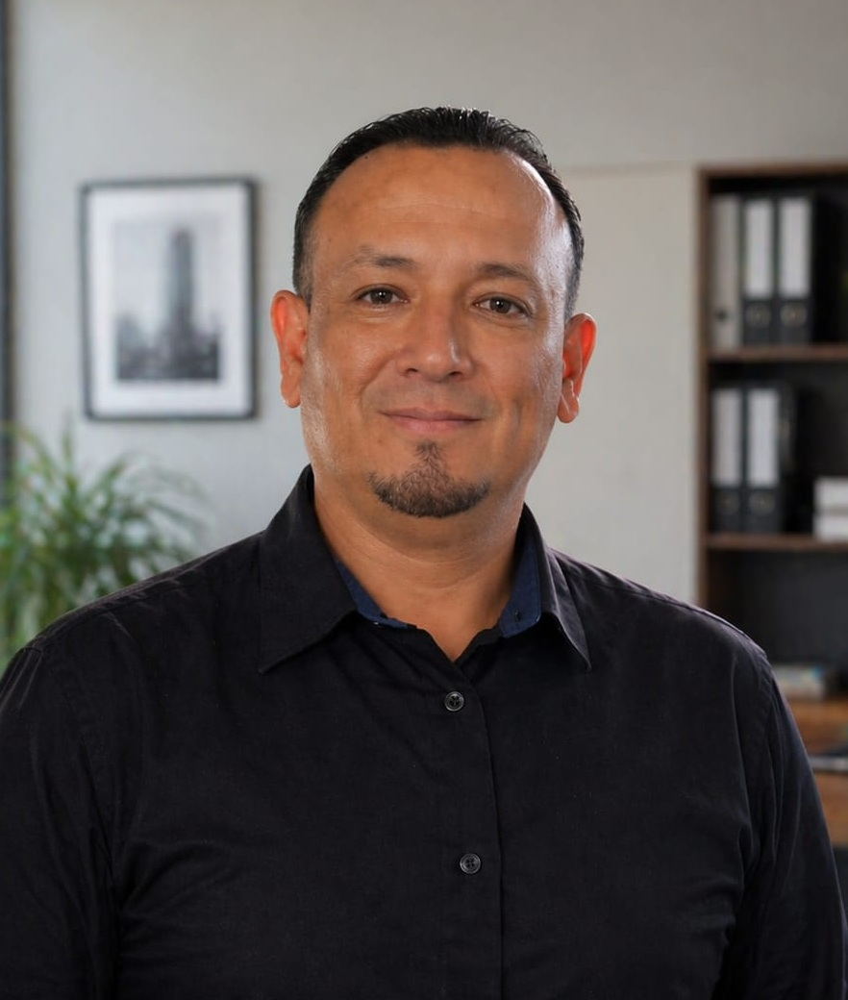
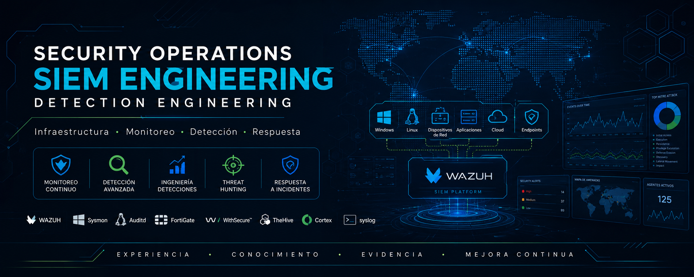

 

  

<h1 align="center">
Lenin Fernando Jiménez Herrera
</h1>

<strong>Security Operations • SIEM Engineering • Blue Team • Threat Hunting • Detection Engineering • Incident Response</strong>

---

# 👋 Sobre mí

Bienvenido a mi **Cybersecurity Portfolio**.

Soy un profesional de Tecnologías de la Información con más de **15 años de experiencia** en infraestructura tecnológica, administración de sistemas, redes y soporte para entornos corporativos. A lo largo de mi carrera he participado en la implementación, administración y optimización de plataformas tecnológicas, desarrollando una sólida base en infraestructura y operaciones de TI.

Actualmente enfoco mi desarrollo profesional en **ciberseguridad defensiva**, fortaleciendo competencias en **Security Operations**, **SIEM Engineering**, **Detection Engineering**, **Threat Hunting** e **Incident Response**.

Este repositorio documenta ese proceso mediante laboratorios, investigaciones técnicas, reglas de detección y casos prácticos desarrollados en un entorno controlado, utilizando una metodología basada en evidencia, documentación técnica y mejora continua.

---

# 💼 Experiencia Profesional

Mi experiencia combina conocimientos en infraestructura TI con la implementación y operación de soluciones orientadas al monitoreo y la seguridad.

Durante mi trayectoria he trabajado en actividades relacionadas con:

- Administración de infraestructura tecnológica.
- Administración de sistemas Windows y Linux.
- Soporte técnico especializado.
- Redes y conectividad.
- Virtualización.
- Administración de plataformas Microsoft.
- Seguridad de infraestructura.
- Implementación y administración de plataformas SIEM.
- Integración de fuentes de eventos.
- Administración de agentes.
- Correlación y análisis de eventos.
- Desarrollo y validación de reglas de detección.
- Documentación técnica y procedimientos operativos.

Esta experiencia me ha permitido comprender la relación entre la infraestructura tecnológica y las operaciones de seguridad, aportando una visión integral para el monitoreo, análisis e investigación de eventos.

---

# 🎯 Enfoque Profesional

Mi interés profesional se orienta hacia equipos de **Security Operations Center (SOC)** y **Blue Team**, participando en actividades como:

- Security Monitoring
- SIEM Administration
- Detection Engineering
- Threat Hunting
- Alert Triage
- Event Analysis
- Incident Response
- Continuous Improvement

Busco desarrollar soluciones que permitan aumentar la visibilidad de la infraestructura, optimizar los procesos de monitoreo y fortalecer las capacidades de detección y respuesta ante incidentes.

---

# 🛠️ Tecnologías Principales

Las tecnologías utilizadas tanto en mi experiencia profesional como en el desarrollo de este laboratorio incluyen:

### Security Operations

- Wazuh
- Sysmon
- Auditd
- Suricata
- TheHive
- Cortex
- Sigma
- MITRE ATT&CK

### Sistemas Operativos

- Windows
- Windows Server
- Ubuntu Server
- Ubuntu Desktop
- Kali Linux

### Infraestructura

- Oracle VirtualBox
- Active Directory
- Microsoft Entra ID
- Microsoft 365
- Exchange Online
- Microsoft Purview

### Seguridad de Red

- FortiGate
- WireGuard
- Syslog
- REST API

### Automatización y Administración

- PowerShell
- Bash
- Git
- GitHub

Estas tecnologías forman parte del laboratorio documentado en este portafolio y complementan la experiencia adquirida en proyectos de infraestructura y operaciones de TI.

---

# 🎓 Formación Académica

Mi formación combina estudios formales en tecnologías de la información con capacitación continua en ciberseguridad.

## Educación

- Tecnólogo Superior en Análisis de Sistemas.
- Diplomado en Ciberseguridad.

La actualización permanente constituye una parte fundamental de mi desarrollo profesional, por lo que mantengo un proceso continuo de aprendizaje mediante laboratorios, documentación técnica, cursos y certificaciones especializadas.

---

# 🏅 Certificaciones

Como parte de mi desarrollo profesional he obtenido certificaciones y programas de formación orientados a infraestructura, redes y ciberseguridad.

Entre ellas destacan:

### Microsoft

- Microsoft Security Engineer Career Path

### Fortinet

- Fortinet Certified Fundamentals in Cybersecurity
- Fortinet Certified Associate in Cybersecurity

### Cisco Networking Academy

- Junior Cybersecurity Analyst Career Path
- Networking Devices and Initial Configuration
- Network Addressing and Basic Troubleshooting
- Networking Basics
- Introduction to Cybersecurity
- Introduction to IoT

Además, continúo fortaleciendo conocimientos mediante capacitación continua, práctica en laboratorio y documentación técnica aplicada.

Todas las certificaciones y credenciales pueden consultarse en mi perfil de **Credly**.

---
# 🧪 Mi Laboratorio de Ciberseguridad

El laboratorio documentado en este portafolio constituye un entorno de aprendizaje, investigación y validación técnica diseñado para fortalecer competencias en ciberseguridad defensiva mediante la práctica continua.

Cada implementación se desarrolla siguiendo un proceso estructurado que incluye la planificación del entorno, el despliegue de tecnologías, la generación de telemetría, la validación de configuraciones, la documentación de resultados y el análisis de la evidencia obtenida.

El objetivo no es únicamente aprender a utilizar una herramienta, sino comprender cómo interactúan los diferentes componentes de un entorno de monitoreo de seguridad y cómo pueden contribuir a mejorar la visibilidad, la detección y la respuesta ante incidentes.

---

# 🔬 Metodología de Documentación

Toda la documentación publicada en este repositorio sigue una metodología uniforme para facilitar su comprensión, reproducibilidad y mantenimiento.

Cada proyecto busca documentar de manera transparente:

- Objetivo del laboratorio.
- Arquitectura utilizada.
- Tecnologías implementadas.
- Procedimiento realizado.
- Evidencia obtenida.
- Resultados.
- Conclusiones.
- Lecciones aprendidas.

Cuando corresponde, también se incluyen:

- Consultas de investigación.
- Reglas de detección.
- Eventos generados.
- Capturas de pantalla.
- Referencias técnicas.
- Relación con MITRE ATT&CK.
- Recomendaciones de mejora.

Este enfoque permite mantener una documentación consistente y basada en evidencia, facilitando tanto el aprendizaje personal como la revisión técnica por parte de otros profesionales.

---

# 📂 Contenido del Portafolio

El repositorio se encuentra organizado para reflejar las diferentes áreas de trabajo desarrolladas durante el proceso de especialización.

Entre ellas:

## Foundation

Configuración inicial del laboratorio.

Incluye:

- Arquitectura.
- Infraestructura.
- Despliegue de plataformas.
- Configuración inicial.
- Recolección de telemetría.

---

## Security Monitoring

Implementación de mecanismos de monitoreo para diferentes fuentes de eventos.

Incluye:

- Integración de eventos.
- Validación de telemetría.
- Monitoreo continuo.
- Correlación de eventos.

---

## Detection Engineering

Desarrollo y validación de mecanismos de detección.

Incluye:

- Reglas de detección.
- Ajuste de alertas.
- Casos de uso.
- Validación de eventos.
- Optimización de detecciones.

---

## Threat Hunting

Investigaciones proactivas utilizando la telemetría generada por el laboratorio.

Cada investigación documenta:

- Hipótesis.
- Evidencia.
- Consultas utilizadas.
- Hallazgos.
- Conclusiones.

---

## Incident Response

Casos prácticos orientados al análisis inicial de incidentes.

Incluyen actividades como:

- Recolección de evidencia.
- Investigación de eventos.
- Análisis de procesos.
- Correlación de información.
- Documentación técnica.

---

## Windows Investigations

Investigaciones específicas sobre eventos y comportamientos observados en sistemas Windows utilizando la información generada por Sysmon y otras fuentes de telemetría.

---

## Knowledge Base

Repositorio de documentación técnica, procedimientos, notas de investigación y referencias utilizadas durante el desarrollo del laboratorio.

---

# 🚀 Desarrollo Continuo

Este portafolio continúa evolucionando de manera permanente.

Entre las actividades que continúan incorporándose se encuentran:

- Nuevos escenarios de Threat Hunting.
- Casos de Incident Response.
- Desarrollo de reglas de detección.
- Integración de nuevas fuentes de eventos.
- Automatización de tareas.
- Mejoras en la documentación técnica.
- Nuevos laboratorios orientados a Blue Team.
- Investigación de nuevas tecnologías de seguridad.

---

# 🎯 Objetivo Profesional

Mi objetivo es continuar desarrollándome como profesional en el ámbito de la **ciberseguridad defensiva**, contribuyendo al fortalecimiento de las capacidades de monitoreo, detección e investigación dentro de equipos de **Security Operations Center (SOC)** y **Blue Team**.

Aspiro a seguir ampliando conocimientos y experiencia en áreas como:

- SIEM Engineering.
- Detection Engineering.
- Threat Hunting.
- Incident Response.
- Security Monitoring.
- Automatización de procesos.
- Ingeniería de detección.
- Arquitecturas de monitoreo de seguridad.

Considero que la combinación entre experiencia en infraestructura tecnológica, práctica constante en laboratorio y documentación basada en evidencia constituye una base sólida para el desarrollo profesional dentro de la industria de la ciberseguridad.

---

# 💡 Principios de Trabajo

Los proyectos documentados en este repositorio se desarrollan siguiendo principios que considero fundamentales para el crecimiento profesional y la mejora continua.

- Aprendizaje continuo.
- Documentación basada en evidencia.
- Transparencia en los resultados.
- Experimentación en entornos controlados.
- Mejora continua.
- Organización y estandarización de la documentación.
- Aplicación de buenas prácticas de la industria.
- Desarrollo práctico orientado a escenarios reales.

Más que demostrar conocimientos, este portafolio busca reflejar un proceso constante de aprendizaje, investigación y evolución profesional.

---

# 🤝 Conectemos

Si deseas conocer con mayor detalle mi trayectoria profesional, certificaciones o proyectos, puedes visitar los siguientes recursos.

---

> *"La ciberseguridad defensiva no se construye únicamente mediante herramientas, sino mediante conocimiento, práctica constante, documentación técnica y mejora continua. Cada laboratorio documentado en este portafolio representa un paso más en ese proceso de aprendizaje y evolución profesional."*

---

⭐ **Gracias por visitar este portafolio.**

Espero que la documentación, los laboratorios y los proyectos aquí presentados reflejen mi compromiso con el aprendizaje continuo, la calidad técnica y las buenas prácticas en ciberseguridad defensiva.

  

 
